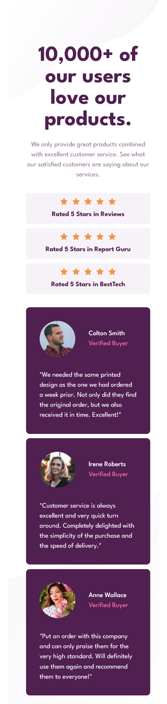

# Frontend Mentor - Social proof section solution

This is a solution to the [Social proof section challenge on Frontend Mentor](https://www.frontendmentor.io/challenges/social-proof-section-6e0qTv_bA). Frontend Mentor challenges help you improve your coding skills by building realistic projects.

## Table of contents

- [Overview](#overview)
  - [The challenge](#the-challenge)
  - [Screenshot](#screenshot)
  - [Links](#links)
- [My process](#my-process)
  - [Built with](#built-with)
  - [What I learned](#what-i-learned)
  - [Continued development](#continued-development)
  - [Useful resources](#useful-resources)
- [Author](#author)
- [Acknowledgments](#acknowledgments)

## Overview

### The challenge

Users should be able to:

- View the optimal layout for the section depending on their device's screen size

### Screenshot

#### Desktop


#### Mobile



### Links

- Solution URL: [https://github.com/NoaSalgado/Social-Proof-Section](https://github.com/NoaSalgado/Social-Proof-Section)
- Live Site URL: [https://noasalgado.github.io/NFT-Preview-Card-Component/](https://noasalgado.github.io/Social-Proof-Section/)

## My process

### Built with

- Semantic HTML5 markup
- CSS custom properties
- Flexbox
- CSS Grid
- Mobile-first workflow

### What I learned

Building this project I learned about how to create a background using multiple images:

```html
<section class="social-proof"></section>
```

```css
.social-proof {
  background-image: url('../images/bg-pattern-top-mobile.svg'),
    url('../images/bg-pattern-bottom-mobile.svg');
  background-position: top right, bottom center;
  background-repeat: no-repeat, no-repeat;
  padding: 10rem 2rem 2rem 4rem;
  display: grid;
  gap: 3rem;
  min-height: 100vh;
}
```

### Useful resources

- [CSS Multiple Backgrounds](https://www.w3schools.com/css/css3_backgrounds.asp) - This helped me to use the two images for the section background

## Author

- Frontend Mentor - [@NoaSalgado](https://www.frontendmentor.io/profile/NoaSalgado)
- Twitter - [@noasalgadodev](https://twitter.com/noasalgadodev)
